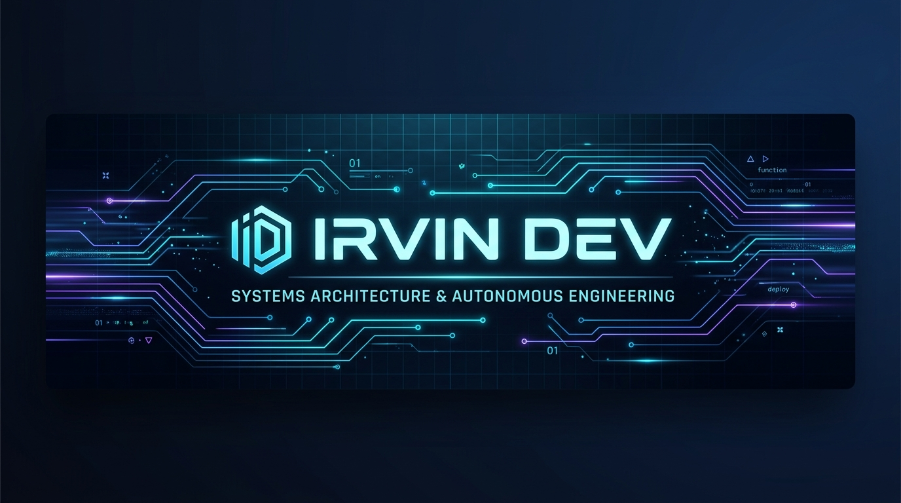

<div align="center">
  

  <br />

  [](https://github.com/)
  [](https://github.com/)
  [](https://github.com/)
  [](https://github.com/)
  [](https://github.com/)
</div>

---

# 🛒 POS Abarrotes & Granel

> **Sistema Punto de Venta (POS) Offline-First de Alta Resiliencia para Comercio Minorista y Abarrotes.**  
> Diseñado bajo arquitectura desacoplada, ergonomía visual neo-brutalista y compatibilidad multiplataforma (Web & Android).

---

## 📌 Descripción del Sistema

**POS Abarrotes & Granel** es una solución integral de punto de venta desarrollada específicamente para optimizar la operativa diaria en abarroterías, fruterías, carnicerías y comercios minoristas. Resuelve la fricción habitual del cobro rápido y el despacho de productos fraccionados mediante un módulo especializado en **pesaje y venta a granel**, complementado con un riguroso sistema de **control de turnos, arqueos de caja (cortes X/Z), inventario con semaforización de stock crítico y emisión de tickets térmicos.**

Construido bajo el paradigma **Offline-First**, el sistema garantiza continuidad operativa ininterrumpida ante cortes de red o fluido eléctrico local, ejecutándose con fluidez tanto en navegadores web de escritorio como en terminales táctiles y dispositivos móviles mediante su APK nativo en **Capacitor Android**.

---

## ✨ Módulos y Características Principales

| Módulo | Funcionalidades Clave |
| :--- | :--- |
| ⚡ **Terminal de Venta Rápida (Caja)** | Facturación en tiempo real, búsqueda predictiva por nombre o código, compatibilidad con lectores de código de barras HID y soporte para múltiples métodos de pago (Efectivo, Tarjeta, Transferencia). |
| ⚖️ **Venta a Granel y Fraccionada** | Cálculo dinámico por peso exacto (kg, gramos o fracción), cálculo automático de cambio y cobro de mercancía sin código de barras fijo. |
| 📑 **Control de Turnos y Arqueos** | Apertura con fondo inicial, registro de entradas/salidas de efectivo, arqueo ciego, emisión de Cortes de Turno (Corte X y Corte Z) y auditoría de diferencias. |
| 📦 **Inventario & Almacén** | Catálogo modular de productos, control de stock mínimo con alertas visuales de desabastecimiento, ajuste rápido de precios y administración de categorías. |
| 🧾 **Tickets y Códigos de Barras** | Generación y previsualización de tickets listos para impresoras térmicas ESC/POS (58mm/80mm) y generador integrado de códigos de barras (EAN/Code128). |
| 📱 **Multiplataforma & Android Ready** | Ejecución en navegadores modernos y empaquetado nativo para tablets y smartphones Android mediante `@capacitor/android`. |

---

## 🛠️ Stack Tecnológico

- **Frontend Core:** [React 19](https://react.dev/) + [TypeScript 5.8](https://www.typescriptlang.org/)
- **Build Tool:** [Vite 6](https://vite.dev/)
- **Estilos & UI:** [Tailwind CSS v4](https://tailwindcss.com/) + [Lucide React](https://lucide.dev/) (Iconografía)
- **Runtime Móvil:** [Capacitor 8.5](https://capacitorjs.com/) (Soporte nativo Android & PWA)
- **Resiliencia & QA:** Persistencia local estructurada, Error Boundaries defensivos y suites de estrés de hardware / concurrencia transaccional.

---

## 🚀 Instalación y Puesta en Marcha

### Prerrequisitos
- **Node.js** v18.0 o superior
- **npm** v9.0 o superior
- *(Opcional para Android)* Android Studio & SDK Android instalado

### 1. Clonar el repositorio e instalar dependencias
```bash
git clone https://github.com/tu-usuario/POS.git
cd POS
npm install
```

### 2. Ejecutar en entorno de desarrollo (Web)
```bash
npm run dev
```
La aplicación estará disponible localmente en `http://localhost:3000`.

### 3. Compilar bundle de producción
```bash
npm run build
```

### 4. Sincronizar y generar APK Android (Capacitor)
```bash
# Compilar frontend y sincronizar assets con el proyecto nativo Android
npm run build:apk

# Abrir el proyecto en Android Studio
npm run cap:open
```

### 5. Pruebas de Estrés y Resiliencia
```bash
# Ejecutar benchmark de concurrencia e inyección masiva de transacciones
npm run stress

# Ejecutar validación de estresores residuales
npm run test:residuals
```

---

## 📁 Estructura del Proyecto

```text
POS/
├── android/               # Proyecto nativo Capacitor para Android
├── assets/                # Banners e identidad visual del repositorio
│   └── irvin-dev-banner.jpg
├── public/                # Assets estáticos, manifest PWA, service worker e iconos
├── src/
│   ├── components/        # Componentes UI (Modales, Barcode, Tickets, Cortes)
│   ├── types/             # Definiciones e interfaces TypeScript estrictas
│   ├── utils/             # Utilidades de cálculo, formateo y persistencia
│   ├── views/             # Vistas principales (Ventas, Inventario, Turnos, Ajustes)
│   ├── App.tsx            # Shell principal, navegación y estado global
│   ├── index.css          # Configuración de diseño y temas Tailwind CSS v4
│   └── main.tsx           # Punto de entrada de la aplicación
├── tests/                 # Suites de benchmark y análisis de estresores
├── capacitor.config.ts    # Configuración de Capacitor Android
├── package.json           # Dependencias y scripts del proyecto
└── vite.config.ts         # Configuración del empaquetador Vite
```

---

## 🧩 Plantilla de Banner Reutilizable (Para Futuros Proyectos)

Para mantener una identidad visual consistente en todos los proyectos de **Irvin Dev**, incluye el siguiente bloque al inicio de tu `README.md`:

```html
<div align="center">
  

  <br />

  [](https://github.com/)
  [](https://github.com/)
  [](https://github.com/)
</div>
```

---

## 👤 Autor & Arquitectura

Desarrollado y mantenido por **Irvin Dev**.  
*Enfoque en arquitectura resiliente, sistemas distribuidos y desarrollo de software de alta disponibilidad.*
